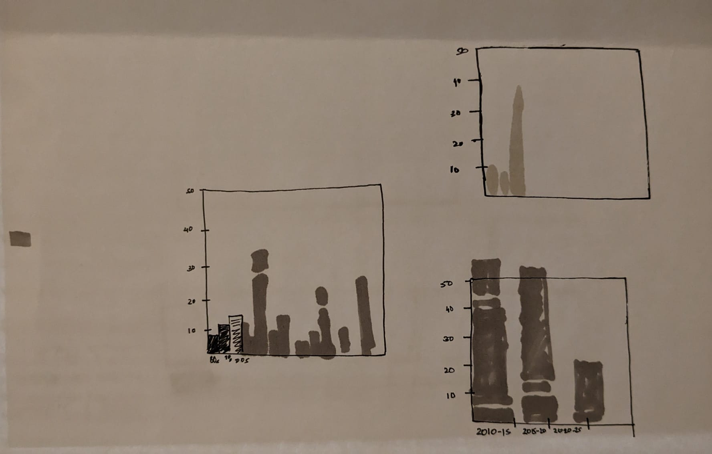

[Back to home page](/README.md)

# Make Over Monday: Critique by Design

## Step 1: Choosing a Data Visualization to Redesign 
Makeover Monday Data Selected: First visualization on https://k12ssdb.org/

Why did I choose this?
It is a pertinent topic. When I looked at the existing visualization; at first glance it confused me (the numbers looked small compared to my perception of deaths from shootings, and when I traced it to y-axis, the numbers didn’t match up). The viz had data for over 50 years. Having low mental bandwidth, I felt there was room to convey the story more succinctly. It felt like a good challenge to myself.  
 

## Step 2: Critiquing 
Using Stephen Few’s Data Visualization Effectiveness Profile to critique the visualization.

Usefulness
Is it useful for the intended audience?  Does it communicate valuable information?
The chart is titled ‘Number of people killed in active shooter attacks at schools each year’. The intended audience can be imagined to be the magazine reader (the watermark suggests the article appeared in NYT). The axis labels have room for improvement- If the reader wants to know the number for 2002, the reader has to count years and trace it on the x-axis. The blank areas - with 0 deaths - can be confusing at first glance. The y axis can make the reader flip the page in an instant – because it doesn’t help reader find the answer to the question in the title. For bars not highlighted, inferring the number from the graph is next to impossible. The bar that reads ‘Sandy Hook killed 26’ aligns with 30 on y axis, which in addition to everything, can be confusing at first-glance.
It does not communicate any information (beyond the ones highlighted – Sandy Hook, Uvalde, etc (if that was the point of the visualization, the rest of the bar chart is unnecessary), and makes the reader doubt its credibility once traced to y-axis values).

Completeness
Does the visualization have everything necessary to make it understandable?
While the title sets the context (reader would expect to see pattern of deaths from shooting over the years) which seems simple, the y-axis numbers that don’t match-up with the highlighted numbers (Sandy Hook example as outlined above), which is confusing at first glance. For the non-highlighted bars, it is impractical to extract information for, and brings the completeness score down.

Perceptibility
Can the reader understand the information with minimal effort? Is the visualization type appropriate?  Does it use illogical comparisons?
Effort is required to trace the year of interest on x-axis (you have to count, and through missed spaces). And then when you come to y-axis, and you trace the bar to the scale with your hand, and the numbers don’t seem to match – Sandy Hook’s 26 deaths aligns with what seems to be 30 on y-axis (which can take a moment to make sense – once you scroll down and look at the adjunct stack bar).

Truthfulness
Is the visualization accurate, reliable and valid?  Is it representing what it says it is, and in the most complete and truthful manner? Does it misrepresent the data or make comparisons that aren't correct?
The visualization specifies that the numbers don’t include gunmen; that is an information relevant to the audience. Parkland (17) and Santa Fe (10) happened in the same year. They sum to 27. But that bar is lower than Sandy Hook’s 26! A seemingly blatant miss like this makes us doubt the credibility of the visualisation and convinces us that it’s false representation. But once you scroll down and see the larger adjunct stacked bar for Sandy Hook, it makes sense. But since numbers can’t be traced to y-axis, and scale isn’t clear, you cannot validate it yourself to gain the credibility back.

Intuitiveness
Is it easy to understand and clearly communicates the information?  If unfamiliar, does it include easy to understand instructions on how to interpret it?
A bar chart to show year to year trend is very intuitive. The chart contains information for 50 years, that could be too many to retain information, and without the numbers for each year, it’s utility to the reader in constricted to only getting a sense of the trend.

Aesthetics
It is interesting / enjoyable to look at?  Is it a good example of what a beautiful data visualization might look like?  Is it somewhere in the middle - pleasing but otherwise not distracting to look at?
The aesthetics are alright. The font size choice could have been better – the fonts for ‘Sandy Hook’, ‘Columbine’ – could have been smaller. ‘Uvalde’ is in bold. The red-grey choice is good aesthetically, but would have been ideal if the objective was only to highlight select shootings only.

Engagement
Does it lead the audience to learn more about the topic?  Does it inspire the audience to talk about the data or share it with others?
The audience has to trace years, and the numbers, which unless someone really needs it, won’t have the time for. So, in its current form, since it doesn’t present the data explicitly, the chart has limited potential to inspire a discussion or engage the audience.

Comparing: Stephen Few’s Method versus Good Charts Method
The Good Charts Method is natural: that’s how you approach a visualisation – what did you see first? What ideas form first? And then you assess what you like and dislike, and what would you like to change. It outlines a process that’s instinctive and common for most.
Stephen Few’s Method seems to complement the above method, in the sense that ‘what you like/dislike’ can be subjective. Few’s method gives students the toolkit to objectively dissect what we like/dislike and why.
The method could be made easier to navigate by outlining specifics to look out for. For example for aesthetics, outlining recommended font, color, layout, alignment requirements would be helpful for the user to objectively decide on the score.

## Step 3: Sketching

The primary thing I wanted to achieve was to make the viz. feel succinct while still retaining the information. In the first attempt I made binned years together to make the x-axis shorter. The overall height of the bar would give the trend over the years. A bar each for each shooting would give a sense of number of incidents in each bin and also the casualties in each. But after plotting I realized that the white spaces were adding to the height and could be misleading (a bin with more number of incidents but overall lower death count could be higher than the next bin that has in reality higher number of deaths)

 
Final sketch- In the final sketch I decided to thus do away with stacks. While I lose the year-on-year information in this case, I decided that since the intention is to convey the number of deaths from school shooting, the priority would be to have a succinct, easy to process visualization. I prioritised that over retaining all available information. The picture below also has in blue the inputs I received from my peers.
I wanted to keep the information of major and memorable incidents, but couldn’t decide the best way to retain it. Putting it under the x-axis, I expected would be confusing.

  
## Step 4: Testing the Solution: Peer Critique
Feedback:
Critique 1: student, 21
Critique 2: adult/student, 27
I used the seed questions to get preliminary inputs, which gave me a sense of major and minor issues with the visualization, and informed questions for the next rounds.

1.	Can you tell me what you think this is?
C1: a graph depicting the numbers of students killed in school shooting in 5-year intervals 
C2: This is a chart showing the number of people killed in active school shootings in 5 year bins.

Take-away for self: ‘School’ shooting can suggest that numbers are for students, so maybe make it explicit. The audience seem to focus on 5-year bins, is that something I’m okay with (showing overall trend) or do I want to show year on year data? The entire data spanning over 30 years is too much information in my opinion, and since the objective I intend is to present the increasing number of casualties, the 5-year bins, help me do it succinctly, whilst retaining information in the interactive graph for those who need it.
  
2.	Can you describe to me what this is telling you?
C1: school shootings have increased and keep on increasing
C2: ⁠The takeaway seems to be the number is increasing - however, the takeaway is weakened by me trying to reason if the number is only growing because of two outlier events pointed out, or because of actual trends.

Take-away for self: A stacked bar chart, with information on number of death and year available, will easily help answer such questions for audience needing more detail.

3.	Is there anything you find surprising or confusing?
C1: confusing: the graph doesn't say in which range the numbers are in (hundreds or thousands) or it is the number itself. 
The names written at the bottom are of one particular shooting. So is the number above it only for that shooting or the name is written to say that the shooting happened in the year range.
C2: ⁠I find the buckets confusing only because of the mental work I need to do to interpret the current bucket.

Take-away for self: The names at the bottom are confusing.

4.	Who do you think is the intended audience for this?
C1: everyone. Who needs to be made aware. Politicians etc
C2: the intended audience are policymakers related to gun reform or gun control

Take-away for self: NA

5.	Is there anything you would change or do differently?
C1: NA
C2: a binned bar chart hides detail, and trying to tie a 5-year span to a specific event is vague. I think a line chart of morbidities would communicate more of what you want to communicate. Also, maybe a separate line showing “number of shooting events” would help underline trends too.
Take-away for self: Should I do a line graph?

Critique 3: Class Group Critique

Following the above two feedback, the primary question I had was if I should do a line chart instead. In the class group critique, I asked the seed questions, followed by additional questions I now had. The seed questions didn’t have new inputs as such, but they gave me valuable feedback that a US audience would have:
1.	I skipped ‘the shooter not included’ detail as it didn’t seem relevant to me. The discussion in class was useful as they explained to me that is a detail that a US audience would look out for to form an opinion.
2.	Specifying ‘US’ in the title:
3.	Stacked bar chart would allow me to retain more information (individual shooting + can highlight the main ones there)
4.	The choice of colour red in this context is conveying something and evokes emotions. Do I want to use red?
   
The main question I had for them was their opinion over line versus bar. They agreed that bar present information more succinctly, and I should try out stacked bar to incorporate the inputs.

## Step 5: Final Design

For my final design I decided to stick with bars and aggregating the information (over a trend line), but incorporated the input to have the information from the major and memorable incidents (Uvalde, Sandy Hook, Columbine, Santa Fe, Parkland) using stacks.

I didn’t want the reader to have to trace the number to y-axis, and hence wanted numbers on the top of each bar. Care was taken to retain a chronological order where possible- Parkland (February’18) happened Santa Fe (May’18)- and flow is thus from bottom to top. The one thing I would have liked to have had is sum of the numbers on the top for stacked columns too, which in the current version is missing. 

I have the made ‘people’ bold in title since the obvious assumption would be the number is about school children.

The visualisation shows that deaths from school shooting increased starkly after 1995, and again after 2010. The numbers for incidents etched to public’s memory are available in the interactive visualisation, and reader can compare if the spike is because of that one horrific incident or were there more incidents in the period contributing to the peaks.

While numbers for 2020-22 was available, I decided to exclude it as a reader in rush (who would miss the label detail that the last bin is <5 years) might go with the take-away that numbers decreased, and for a serious issue like this, we cannot risk such a conclusion.

Another caveat with this visualization that I’m apprehensive about is that data was not available on the website. I made the tabular data myself, which as I have critiqued above, is next to impossible to extract actual numbers from. So actual numbers might be +/-3 units.

Another apprehension I have is that the numbers seem low. But since the objective was to redesign, I didn’t validate the data beyond the examples highlighted.

<noscript></noscript><object class='tableauViz'  style='display:none;'><param name='host_url' value='https%3A%2F%2Fpublic.tableau.com%2F' /> <param name='embed_code_version' value='3' /> <param name='site_root' value='' /><param name='name' value='redesign_critique&#47;Final' /><param name='tabs' value='no' /><param name='toolbar' value='yes' /><param name='static_image' value='https:&#47;&#47;public.tableau.com&#47;static&#47;images&#47;re&#47;redesign_critique&#47;Final&#47;1.png' /> <param name='animate_transition' value='yes' /><param name='display_static_image' value='yes' /><param name='display_spinner' value='yes' /><param name='display_overlay' value='yes' /><param name='display_count' value='yes' /><param name='language' value='en-US' /><param name='filter' value='publish=yes' /></object>
         
 
