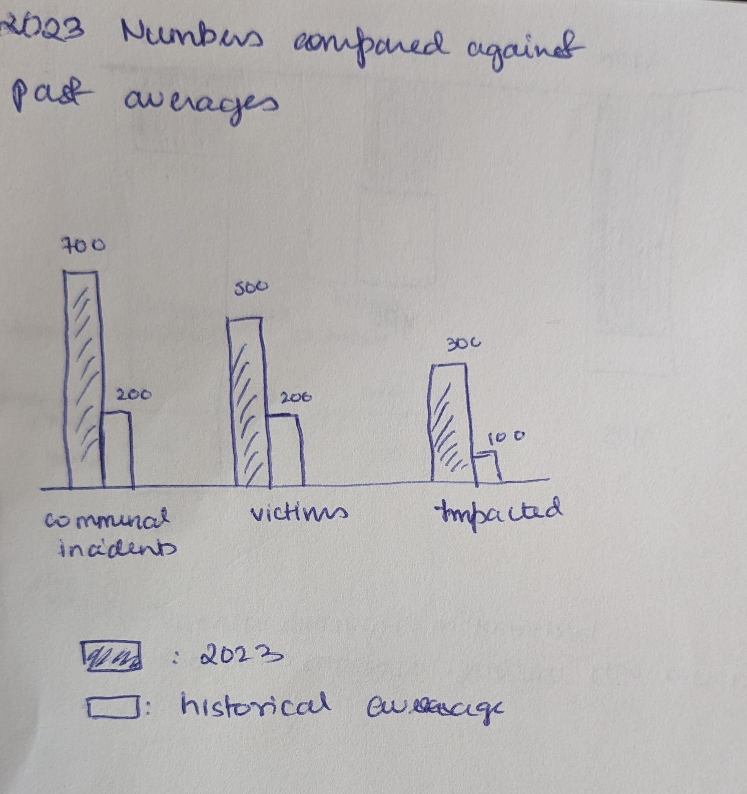
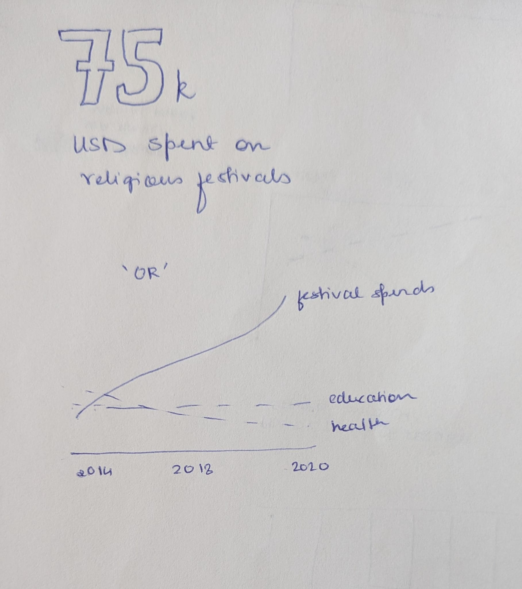
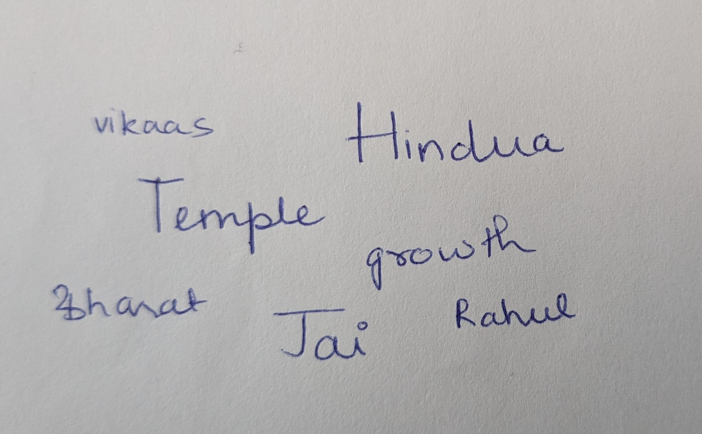

[Back to home page](/README.md)

# Final Project: Declining Democracy

## Background 

Extremist right-wing forces are on the rise in countries around the world. In India it started in 2014. For context, the right-wing BJP party has been in power since 2014. The incumbent government in 2014 was marred by financial scams right before the elections and post 2008 crisis effects were reflected in the growth numbers. The contending right-wing party promised an honest government that would double economic growth by 2020 (that didn’t happen).
When they first won in 2014, there were hints of religion in their campaign, and they won by majority vote. Between 2014-2018, there were scattered instances of violence against minorities. Strengthened by popular vote, the ‘Hindu Nationalist’ agenda became more evident, going against the secular nature of the democracy. Since winning the election again in 2019, the abuse of their majority power has been more blatant and the violence more extreme. With elections scheduled in 2024, I wanted to analyse the undermining of democracy and convey the salient story, hopefully objectively. The topic is pertinent because the undermining of democratic values is not unique to India. It’s happening in many countries across the world, including the US.
I want to visually convey the story of a democracy at risk.

## Outline

There are several ways in which democracy is undermined these days. Often, those who pose to risk to democratic values come to power by democratic means. Once in power, they undermine constitutional values, weaken systems, and propagate hate.
The actions of the ruling government in India have been in-line with these patterns found elsewhere in the world where democracy has been undermined and risked. The story line will consider details of some these aspects.
The primary data I want to focus is lives lost and the rise in communal violence. No amount of growth and progress can compensate for citizens feeling scared (and being killed) for what is constitutionally their right. The government agency responsible for tracking these numbers discontinued the tracking since 2017 on grounds that these numbers are ‘unreliable’. This makes matters difficult for the analysis, but I didn’t want this to deter from looking at it. Independent organizations committed to justice and safeguarding democracy are now tracking these numbers. I will be using the data available with Centre for Justice and Peace, that has data on lynching and communal incidents across states (https://cjp.org.in/hate-map) for 2023. These can be analysed against historic numbers (pre 2017 numbers tacked by the above-mentioned government agency). The data here is collated from reports of violence featuring in select newspapers, and thus is expected to be gross underestimation of actual numbers. But in absence of official sources, it’s small-scale efforts like these that are the source of information. The data is available in the source in a visual format. I have collated the numbers into a table to be used later in the project for plotting.

A secular government is required to not align itself with any religion. But the government since 2014 has been explicit in violating this. It also reflects in government spending on religious events. I will be using the data available with Centre for Justice and Peace, that analysed this pattern in government spending. The data is available here - https://cjp.org.in/communal-violence-in-the-year-2021/ - and I have collated the data into table to be used for visualizing in the project.

Another visualization that will be interesting to see would be a word cloud – visualize the most commonly appearing words in Prime Minister’s public speeches. The speeches are available at - (https://www.narendramodi.in/category/text-speeches) – and it can be analysed in word cloud to view the recurring themes in these speeches. A rough sketch (rough as data will have to be tokenized and cleaned when creating the final word cloud). I plan to focus on speeches made during the last election to visualize elements of polarization that might have supported their victory at the cost of secular values.

Tentative: Since this is a topic that impact humans – lives – I would like to experiment with data sonification, where sounds with positive (for economic growth) and negative (for lives lost) connotations are used to make the audience feel a morsel of the lived reality of living in a communally charged environment. Do you feel the economic growth albeit the fear around? Or can you feel what the minority feels?

## Platform

I intend to primarily use Tableau and Shorthand. For data sonification I might be working and mixing audios, but that is something I need to research further.

With this story, the goal is to influence voters to consider the implications of their votes. I have heard people say that they don’t condone the violence, but when the election time comes, the party’s campaign, funded by its crony capitalism agenda, overpowers. And people forget the violence. I hope to etch the sad reality into conscience - that the progress is a façade; the reality is systematic violence and loss of democratic values.
